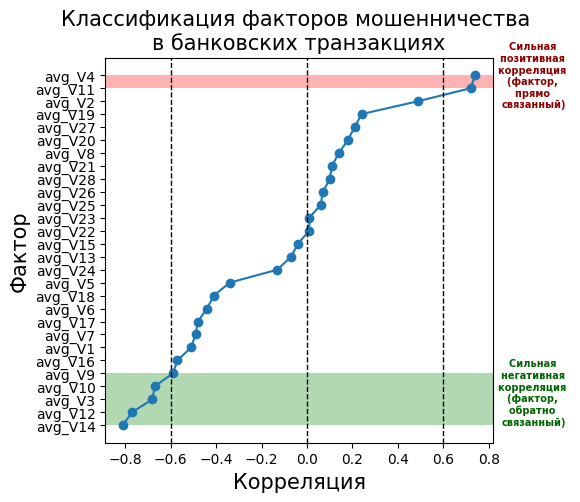

# Классификация факторов мошенничества в финансовых операциях
## Датасет: [Credit Card Fraud 2023](URL "https://www.kaggle.com/datasets/nelgiriyewithana/credit-card-fraud-detection-dataset-2023")
Классификация факторов мошенничества банковских операций с помочью Apache Spark

Выведя средний значения по коррелляциям, я классифицировал факторы фрода для того, чтобы обратить внимания на те факторы, которые сильно влияют на совершение фрода клиентами банка.

Как мы видим на графике: 
1. 4 и 11 факторы сильно положительно влияют на совершение фрода.
2. 3, 9,10, 12 и 14 факторы сильно отрицательно влияют на совершение фрода.  

Выводы для бизнеса: 
1. Брать аккаунты, у которых резко повышаются 4 и 11, под наблюдение либо изучить поведение транзакций.
2. Создать среду, при которой факторы 3, 9,10, 12 и 14 совершаются пользователями чаще, что должно сократить совершение фрода.
